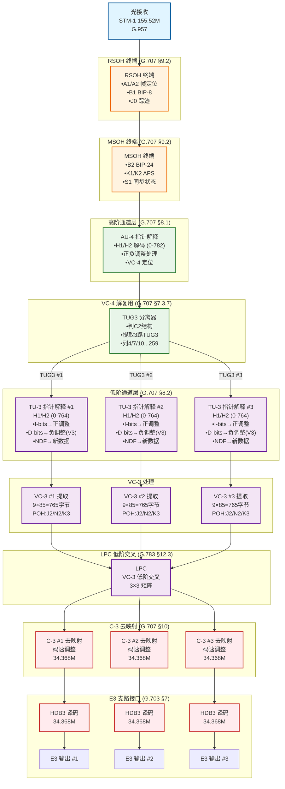
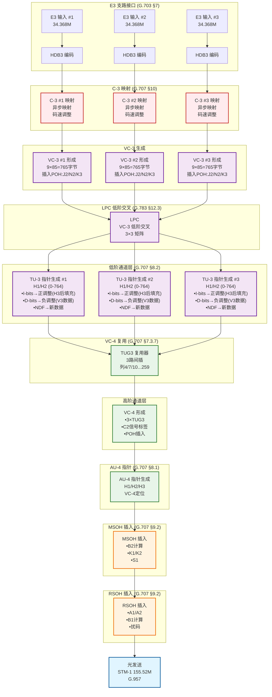
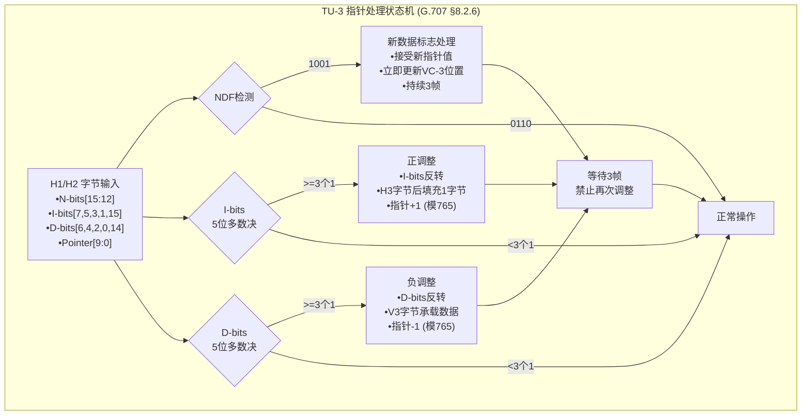
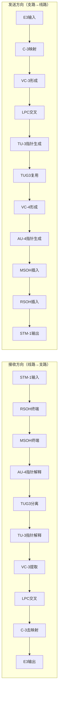

# SDH VC3 双向数据流设计

> **适用范围**: STM-1 线路侧与 E3 支路侧之间的 VC3 处理  
> **协议依据**: ITU-T G.707, G.783  
> **设计重点**: 接收方向（线路→支路）与发送方向（支路→线路）完整数据流  
> **版本**: v1.1  
> **日期**: 2026-04-07

---

## 目录

1. [接收方向：线路侧 → 支路侧](#一接收方向线路侧--支路侧)
2. [发送方向：支路侧 → 线路侧](#二发送方向支路侧--线路侧)
3. [TU-3 指针处理详解](#三tu-3-指针处理详解)
4. [双向对照简图](#四双向对照简图)
5. [VC3 处理关键参数对照](#五vc3-处理关键参数对照)
6. [双向差异说明](#六双向差异说明)

---

## 一、接收方向：线路侧 → 支路侧



### 接收方向处理要点

| 处理阶段 | 功能说明 | 协议依据 |
|---------|---------|---------|
| **光接收** | 光电转换，时钟恢复，串并转换 | G.957 |
| **RSOH终端** | A1/A2帧定位，B1误码监测，J0踪迹 | G.707 §9.2 |
| **MSOH终端** | B2误码监测，K1/K2 APS，S1同步状态 | G.707 §9.2 |
| **AU-4指针** | 解释H1/H2（10位值0-782），正负调整处理 | G.707 §8.1 |
| **TUG3分离** | 根据C2字节判别结构，提取3路TUG3 | G.707 §7.3.7 |
| **TU-3指针** | 解释H1/H2（10位值0-764）：I-bits正调整，D-bits负调整，NDF新数据 | G.707 §8.2 |
| **VC-3提取** | 9行×85列，提取POH（J2/N2/K3） | G.707 §7.3 |
| **LPC交叉** | VC-3级低阶交叉连接（可选） | G.783 §12.3 |
| **C-3去映射** | 码速调整解调，HDB3译码 | G.707 §10, G.703 §7 |

---

## 二、发送方向：支路侧 → 线路侧



### 发送方向处理要点

| 处理阶段 | 功能说明 | 协议依据 |
|---------|---------|---------|
| **E3输入** | HDB3码型接收，34.368M时钟恢复 | G.703 §7 |
| **C-3映射** | 异步映射，码速调整，插入POH | G.707 §10 |
| **VC-3形成** | 9行×85列结构，生成J2/N2/K3 | G.707 §7.3 |
| **LPC交叉** | VC-3级低阶交叉连接（可选） | G.783 §12.3 |
| **TU-3指针** | 生成H1/H2（10位值0-764）：I-bits正调整（H3后填充），D-bits负调整（V3数据），NDF新数据 | G.707 §8.2 |
| **TUG3复用** | 3路VC-3间插复用到TUG3 | G.707 §7.3.7 |
| **VC-4形成** | 3×TUG3 + POH，C2信号标签 | G.707 §7.3 |
| **AU-4指针** | 生成H1/H2/H3，定位VC-4 | G.707 §8.1 |
| **MSOH插入** | B2计算，K1/K2，S1 | G.707 §9.2 |
| **RSOH插入** | A1/A2，B1计算，扰码 | G.707 §9.2 |

---

## 三、TU-3 指针处理详解

### 3.1 H1/H2 字节结构（G.707 §8.2.2）

```
┌─────────────────────────────────────────┐
│           H1/H2 指针字节结构             │
├─────────┬─────────┬───────────────────┤
│  Bits   │  名称   │      功能         │
├─────────┼─────────┼───────────────────┤
│ 15-12   │ N-bits  │ NDF: 0110=正常    │
│         │         │      1001=新数据  │
├─────────┼─────────┼───────────────────┤
│ 11-10   │ 保留    │ 未使用            │
├─────────┼─────────┼───────────────────┤
│  9-0    │ Pointer │ 指针值: 0-764     │
├─────────┼─────────┼───────────────────┤
│ H1中    │ I-bits  │ 7,5,3,1: 正调整   │
│ H2中    │ D-bits  │ 6,4,2,0: 负调整   │
└─────────┴─────────┴───────────────────┘
```

### 3.2 指针调整处理（G.707 §8.2.3）



### 3.3 指针调整对照表

| 调整类型 | I-bits状态 | D-bits状态 | 字节处理 | 指针值变化 | 适用场景 |
|---------|-----------|-----------|---------|-----------|---------|
| **无调整** | 正常 | 正常 | V3字节忽略 | 不变 | 时钟同步 |
| **正调整** | 反转(多数=1) | 正常 | H3后填充1字节 | +1 (模765) | VC-3时钟慢于TU-3时钟 |
| **负调整** | 正常 | 反转(多数=1) | V3承载数据 | -1 (模765) | VC-3时钟快于TU-3时钟 |
| **NDF** | 1001 | 忽略 | 立即更新位置 | 加载新值 | 相位跳变/切换 |

---

## 四、双向对照简图



---

## 五、VC3 处理关键参数对照

| 处理环节 | 接收方向（线路→支路） | 发送方向（支路→线路） | 协议依据 |
|---------|---------------------|---------------------|---------|
| **E3接口** | HDB3译码，提取34.368M | HDB3编码，输出34.368M | G.703 §7 |
| **C-3映射** | 码速调整，VC-3→E3 | 码速调整，E3→VC-3 | G.707 §10 |
| **VC-3帧** | 9行×85列=765字节 | 9行×85列=765字节 | G.707 §7.3 |
| **VC-3 POH** | 终端处理（J2/N2/K3） | 生成插入（J2/N2/K3） | G.707 §9.3 |
| **LPC交叉** | 输入VC-3交叉到输出 | 输入VC-3交叉到输出 | G.783 §12.3 |
| **TU-3指针** | 解释H1/H2（0-764）：I-bits正调整，D-bits负调整(V3)，NDF新数据 | 生成H1/H2（0-764）：I-bits正调整(H3后填充)，D-bits负调整(V3数据)，NDF新数据 | G.707 §8.2 |
| **TUG3位置** | 解复用：列4,7,10...259 | 复用：列4,7,10...259 | G.707 §7.3.7 |
| **VC-4复用** | 解复用TUG3 | 复用TUG3到VC-4 | G.707 §7 |
| **AU-4指针** | 解释H1/H2（0-782） | 生成H1/H2（0-782） | G.707 §8.1 |

---

## 六、双向差异说明

| 对比项 | 接收方向（线路→支路） | 发送方向（支路→线路） |
|-------|---------------------|---------------------|
| **处理本质** | 解映射 + 解复用 + 终端 | 映射 + 复用 + 生成 |
| **指针处理** | 指针解释（解码）：检测I/D-bits，识别调整类型 | 指针生成（编码）：产生I/D-bits，执行调整 |
| **开销处理** | 开销终端（终结，提取信息） | 开销插入（产生，创建信息） |
| **码型变换** | HDB3译码（线路码→NRZ） | HDB3编码（NRZ→线路码） |
| **时钟方向** | 从线路恢复时钟 | 从系统时钟发送 |
| **正调整处理** | H3字节后检测到填充字节，丢弃 | H3字节后插入填充字节 |
| **负调整处理** | V3字节中提取数据 | V3字节中插入数据 |
| **BIP校验** | B1/B2计算并与接收值比较 | B1/B2计算并插入 |
| **告警方向** | 检测并向下游插入AIS | 根据上游状态或故障插入AIS |

### 关键协议条款

| 协议章节 | 内容说明 | 应用场景 |
|---------|---------|---------|
| **G.707 §8.2** | TU-3指针的10位值（0-764），I-bits正调整，D-bits负调整(V3)，NDF新数据 | 指针处理器设计 |
| **G.783 §12.3.1** | Sn/Sm_A适配功能，处理VC-3到VC-4的适配 | LPC交叉模块 |
| **G.707 §19** | ODU/VC复用结构（SDH域为VC复用） | 复用器设计 |
| **G.707 §7.3.7** | TUG3在VC-4中的位置（列计算公式） | TUG3分离/复用 |

---

## 附录：VC3 处理速率参数

| 参数 | 数值 | 说明 |
|------|------|------|
| E3标称速率 | 34.368 Mbit/s | G.703 §7 |
| E3容差 | ±20 ppm | G.703 |
| C-3容器速率 | 48.960 Mbit/s | G.707 Table 7-2 |
| VC-3速率 | 48.960 Mbit/s | 含POH |
| TU-3速率 | 49.152 Mbit/s | 含指针开销 |
| 每VC-4VC-3数 | 3路 | TUG3 #1/#2/#3 |
| 每STM-1VC-3数 | 3路 | 单AU-4 |
| TU-3指针范围 | 0-764 | 10位值 |
| TU-3调整单位 | 1字节 | 正/负调整均为1字节 |

---

*文档待进一步细化完善*
